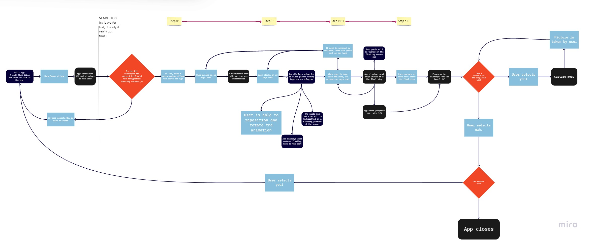
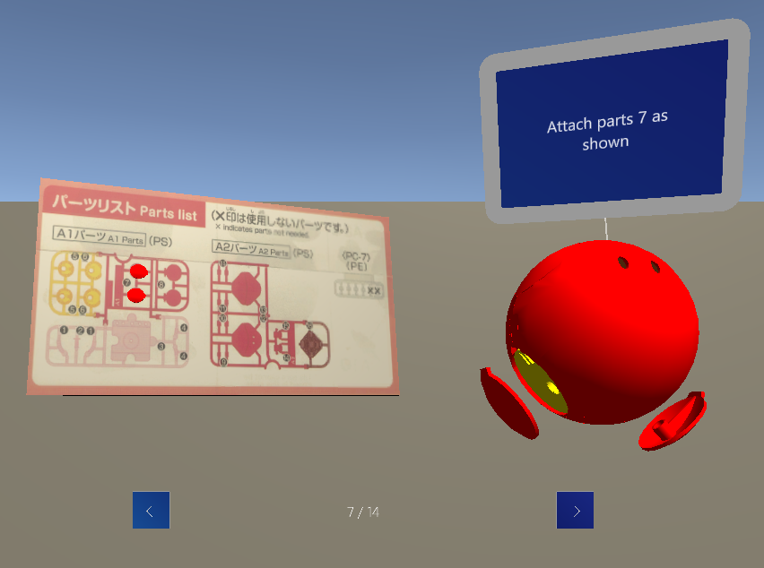
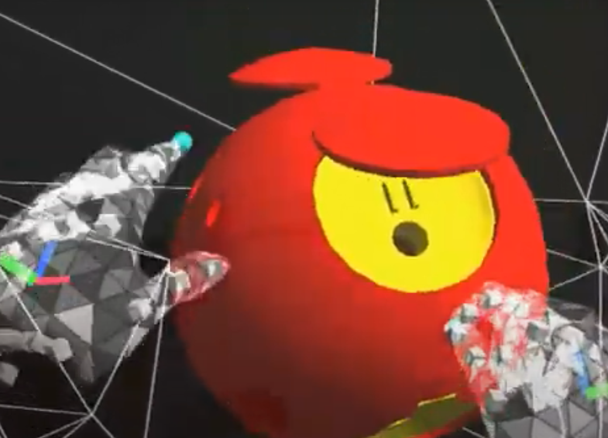

# BuilderBuddy

Table of Contents

- [BuilderBuddy](#builderbuddy)
  - [Description](#description)
  - [Storyboard](#storyboard)
  - [Features](#features)
    - [Implemented ✅](#implemented-)
    - [Future work 🤞](#future-work-)
  - [Demo](#demo)
    - [In Unity Editor](#in-unity-editor)
    - [In HoloLens 2](#in-hololens-2)

## Description

- A mixed reality app that serves as a proof-of-concept to remotely teach students how to build a gunpla model kit! _(especially given the COVID19 situation...)_
- A collab project done by [lyqht](https://github.com/lyqht) and [software312](https://github.com/software312) for Mixed Reality Developer Course by [HelloHolo](https://helloholo.sg/)
  - Special thanks to HelloHolo for providing the 3D model assets and technical help in debugging!
  - We were both later awarded Mixed Reality Developer Course (Merit) certificate.

## Storyboard

See it bigger at https://miro.com/app/board/o9J_ksM-crI=/

## Features

### Implemented ✅

- **Introduction to the guide app**

  - `StartCoroutine()` for text transition timeout
  - `SurfaceMagnetism` used to attach the introduction text to any nearby walls and moves around as the user moves head around

- **State is tracked** with `StateManager`
  - Keep tracks of user's current progress, whether they are in the tutorial or in the building mode.
  - **Progress UI** for back, next and current step (x / 14).
    - Buttons implemented with `PressableButton`
      - can also be clicked with speech commands such as Next, Back, Start.
      - Speech commands configured with custom `SpeechProfile`
    - Attaches to nearby walls similarly, and moves along with the head.
  - **Shows correct models at current steps**
    - On the runner: Current step is highlighted as a 3D object protruding out of the runner
    - The model kit: A scaled `Tooltip` containing text instruction is attached to the non-moving part in the current step, and it always faces in the right orientation to the user. A looping **animation** is also shown to show users how to attach the parts.
    - GameObjects for all the steps are instantiated since the start of the app, they are setActive(true) and setActive(false) depending on the current state/ step number.
- **Models**
  - Both the runner and the model kit **can be moved around and rotated independently**, thanks to `ManipulationHandler` and a `BoxCollider` around respective parent objects.
  - just for fun: you can actually bash the model against the runner
- **Completion of guide**
  - Upon completing all the steps, "You're done" text is shown and a screenshot is taken.

### Future work 🤞

- Az ure Custom ML Model for automatic detection of the kit from the kit's box cover
- Confirmation UI for screenshot and restart

## Demo

### In Unity Editor

### In HoloLens 2

Debug mode to show that the spatial mesh works

Video (this is taken before surface magnetism and manipulation handler on the runner)

https://www.youtube.com/watch?v=SdTLZkyVhaE
